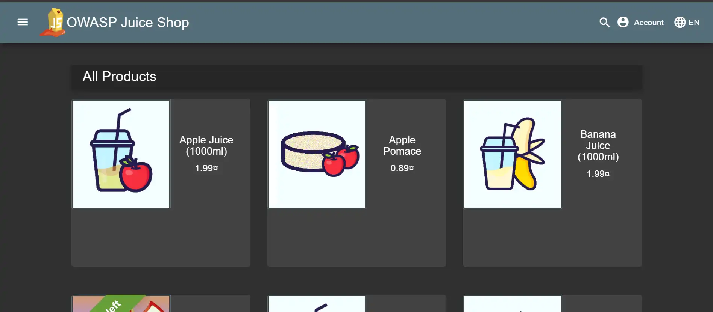
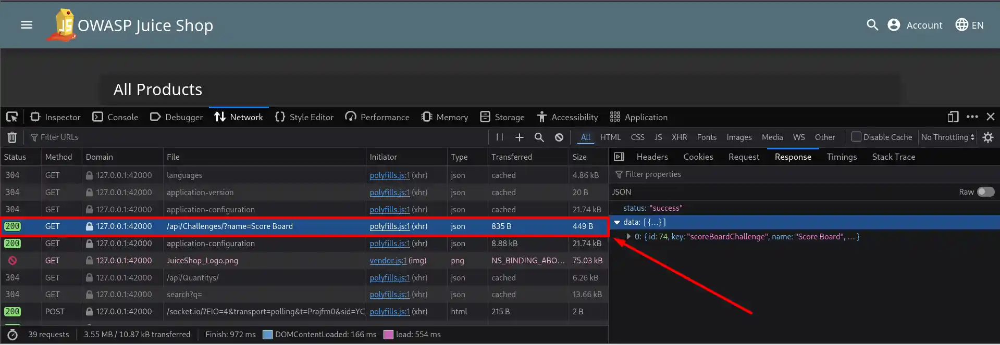
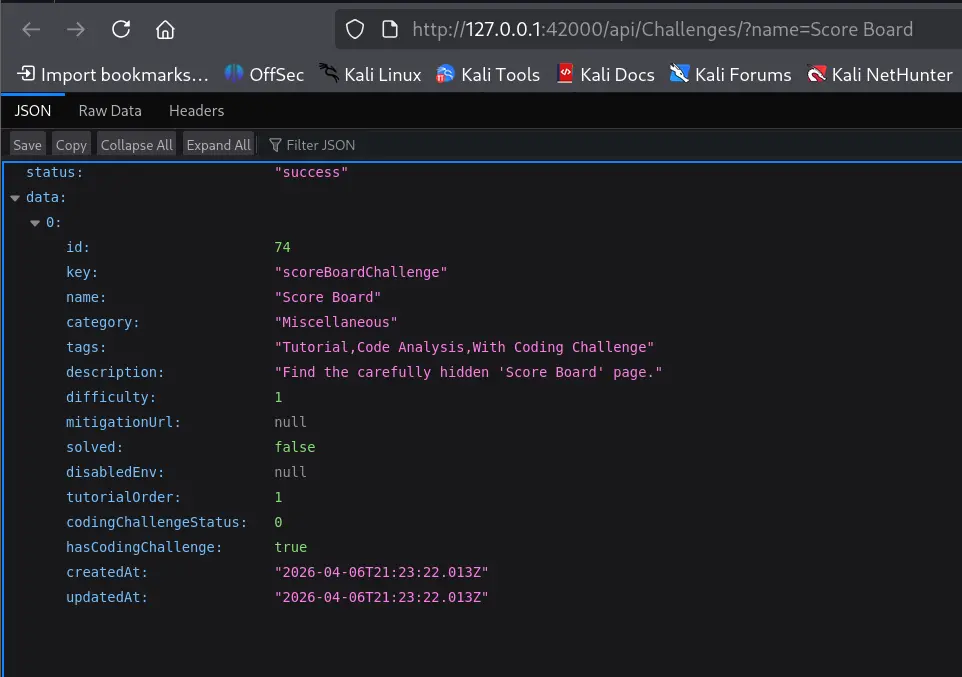
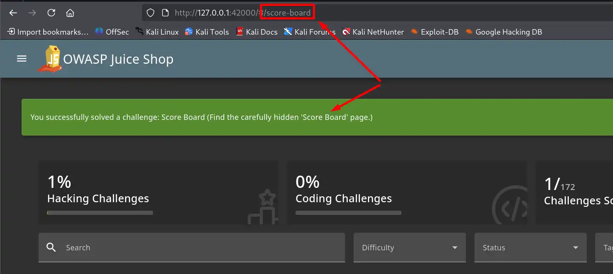

# Finding the hidden score board

## Introduction

In this challenge, we are tasked with finding the hidden score board in the Juice Shop application. The score board is a feature that displays the scores of various challenges and achievements within the application. To find it, we will need to explore the application's functionality and look for clues that may lead us to its location.

## Step 1: Exploring the Application

To begin our search for the hidden score board, we will start by exploring the Juice Shop application. We will navigate through the different pages and features of the application to see if we can find any hints or clues that may lead us to the score board.
As we explore the application, we will pay close attention to any references to scores, achievements, or challenges. We will also look for any hidden links or buttons that may lead us to the score board.

*Image 1: Exploring the Juice Shop application to find clues about the score board.*

## Step 2: Analyzing in Developer Tools

While exploring the application, we will also use the developer tools in our web browser to analyze the network traffic and inspect the elements on the page. This can help us identify any hidden elements or API calls that may be related to the score board. We will look for any API endpoints that may be fetching score data or any hidden elements in the HTML that may be related to the score board.

*Image 2: Exposing the hidden route to the score board.*

*Image 3: Reading the response from the score board API.*

## Step 3: Finding the Score Board

After thoroughly exploring the application and analyzing the developer tools, we may come across a hidden link or button that leads us to the score board. Alternatively, we may find an API endpoint that returns score data, which can help us locate the score board. Once we find the score board, we will be able to view the scores of various challenges and achievements within the Juice Shop application. See the next images for the final result:

*Image 4: Successfully accessing the score board with the hidden route: /score-board*

## Conclusion

In this challenge, we successfully found the hidden score board in the Juice Shop application by exploring the application's functionality and analyzing the developer tools. This exercise highlights the importance of thorough exploration and analysis when trying to uncover hidden features or vulnerabilities in web applications. By paying close attention to details and using the right tools, we can uncover hidden gems like the score board and gain a deeper understanding of how the application works.
